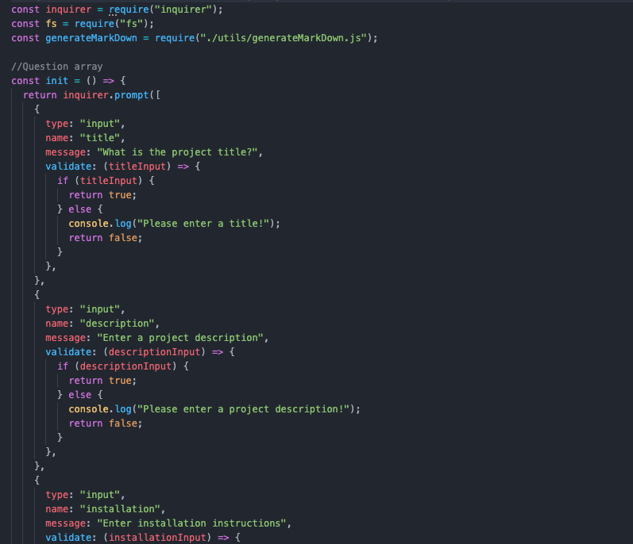
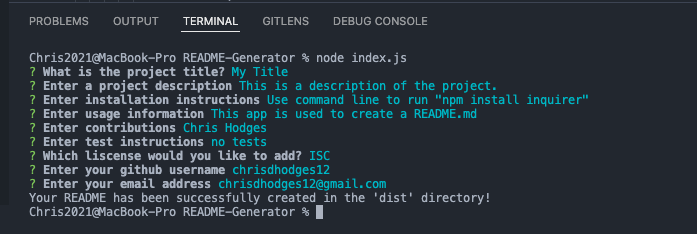
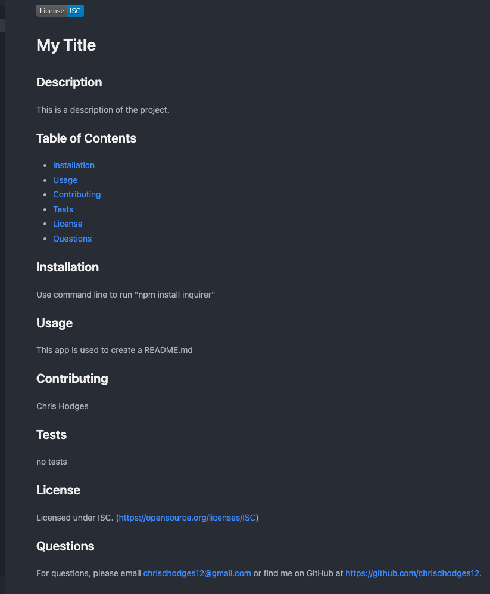

  # README Generator

  ## Description
  This command-line app prompts the user for information about a project in which they would like to create a README for.  The answers to the inquirer prompts are used to generate a markdown from a template.  The data collected includes project title, a description, installation guide, usage information, testing information, contributions, licensing, and contact information.

  Created with node.js.

  ## Table of Contents

  * [Installation](#installation)
  * [Usage](#usage)
  * [Contributing](#contribution)
  * [Tests](#tests)
  * [Questions](#questions)
  * [Media](#media)

  ## Installation
  In the command line, install inquirer by running "npm install inquirer", then run the app by entering "node index.js".

  ## Usage
  Use this README generator to quickly create a professional README.md

  ## Contributing
  Chris Hodges 

  ## Questions
  For questions, please email chrisdhodges12@gmail.com find me on GitHub at https://github.com/sd.

  ## Media

VIDEO:

https://drive.google.com/file/d/1la57PF4ANd_MLWYQC9BH4D94tSIkRsfj/view